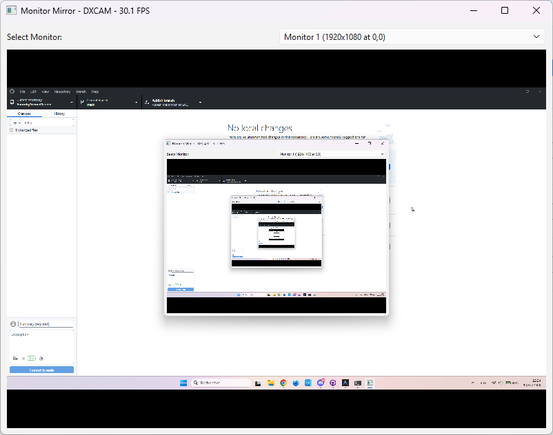

# Foundry Monitor Mirror



[Français](#français) | [English](#english)

---

<a name="français"></a>
## Français

**Foundry Monitor Mirror** est un utilitaire Windows haute performance conçu pour projeter un second moniteur dans une fenêtre tout en conservant le contrôle de la souris. 

Cet outil est idéal pour les sessions de jeu de rôle sur table utilisant **Foundry VTT** (ou tout autre VTT) en personne, particulièrement lorsque vous utilisez un téléviseur comme surface de jeu et que vous êtes positionné à l'envers ou sur le côté par rapport à l'écran.

### Fonctionnalités

- **Capture Haute Performance** : Utilise `DXCAM` (DXGI) pour une latence quasi nulle et un support fluide jusqu'à 60 FPS.
- **Optimisation des Ressources** : Rendu optimisé via QPainter pour minimiser l'usage du CPU et de la RAM.
- **Repli Automatique** : Bascule automatiquement vers `MSS` si la capture matérielle accélérée n'est pas disponible.
- **Contrôle de la Souris** : Transmet les clics gauches, clics droits et glissements vers le moniteur cible.
- **Miroir du Curseur** : Affiche la position de votre souris en temps réel de manière fluide.
- **Logs de Débogage** : Console intégrée et compteur FPS pour surveiller les performances.

### Instructions d'Installation

#### 1. Prérequis
- Windows 10 ou 11.
- Python 3.10 ou supérieur.
- Un GPU supportant DXGI.

#### 2. Installer les Dépendances
```bash
pip install -r requirements.txt
```

#### 3. Lancer depuis les Sources
```bash
python monitor_mirror.py
```

#### 4. Compiler l'Exécutable
```bash
python build_exe.py
```

---

<a name="english"></a>
## English

**Foundry Monitor Mirror** is a high-performance Windows utility to mirror a second monitor into a window and control it with your mouse. 

Designed specifically for in-person **Foundry VTT** sessions where a TV is used as a digital tabletop, it allows the GM or players to view a secondary screen even when positioned at an awkward angle or "upside down" relative to the monitor.

### Features

- **High-Performance Capture**: Uses `DXCAM` (DXGI) for near-zero latency and 60 FPS support.
- **Resource Optimized**: Optimized rendering via QPainter to minimize CPU and RAM usage.
- **Auto-Fallback**: Automatically switches to `MSS` if hardware-accelerated capture is unavailable.
- **Mouse Control**: Pass clicks, right-clicks, and drags to the target monitor.
- **Cursor Mirroring**: Real-time smooth cursor mirroring in the window.
- **Debug Logs**: Built-in console logging and FPS counter for performance monitoring.

### Setup Instructions

#### 1. Prerequisites
- Windows 10 or 11.
- Python 3.10 or higher.
- A GPU that supports DXGI.

#### 2. Install Dependencies
```bash
pip install -r requirements.txt
```

#### 3. Run from Source
```bash
python monitor_mirror.py
```

#### 4. Build Executable
```bash
python build_exe.py
```
